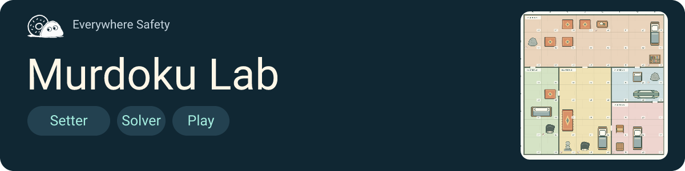
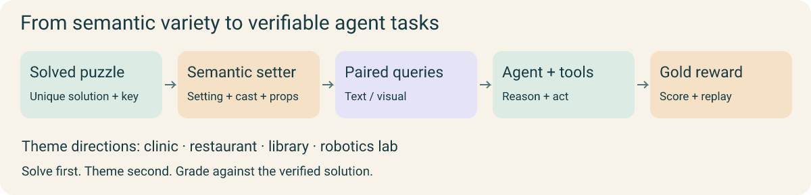
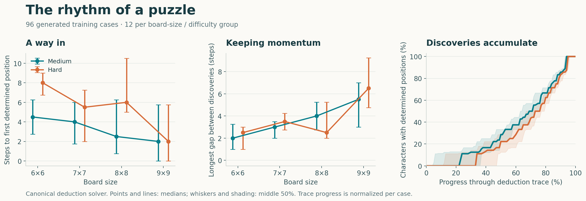

<div align="center">



# Murdoku Lab

[](#export-text-and-vision-queries) [](docs/guides/model.md)

[Website](https://everywheresafety.github.io/murdoku/) · [Blog](https://everywheresafety.github.io/blog/murdoku-as-vhd/) · [Generate](#generate-and-solve) · [Data](docs/guides/data.md) · [Trained example](#trained-example-a-small-model-solving-larger-puzzles) · [Agent Horizon](https://github.com/EverywhereSafety/agent-horizon)

</div>

**Murdoku Lab is a setter, solver and playable environment for Murdoku-like
logic puzzles.** Generate boards and clues, check their solutions, play them in
the illustrated frontend, or export them as verifiable agent-training tasks.

For players: **more detective puzzles to play, create and analyze**. Explore
illustrated scenes, work through the clues, and inspect the deductions behind a
solution. See [what makes a puzzle satisfying](#what-makes-a-puzzle-satisfying).

For researchers: **diverse agentic RL queries with rich semantics**,
stateful tools, and paired text or visual observations. Following [VHD-Play](https://arxiv.org/abs/2609.27321),
solutions are established before the LLM setter adds the setting and story,
providing **gold rewards** for training.



Read the motivation: **[Puzzles for people, verifiable worlds for agents](https://everywheresafety.github.io/blog/murdoku-as-vhd/)**.

## Features

| Component            | What you can do                                                                                 |
| -------------------- | ----------------------------------------------------------------------------------------------- |
| Setter               | Compose varied scenes and semantic themes over verified puzzle structures                       |
| Solver               | Verify accepted cases with CP-SAT and independent DFS; inspect deduction and difficulty signals |
| Playable frontend    | Read clues, place characters and inspect an illustrated board                                   |
| Text + vision export | Produce paired inputs for the same verified case: text or board PNG + clues                     |
| Semantic diversity   | Vary settings, cast and scene labels through optional LLM theming                               |
| Agent environment    | Execute stateful tools and check placement and murderer answers                                 |
| Rollout replay       | Check model trajectories against the executable environment                                     |

## Play, create, analyze

Explore the [Murdoku Lab website](https://everywheresafety.github.io/murdoku/)
for the illustrated casebook and project resources. Place the cast on the board,
follow the evidence, and identify who was alone with the victim.

[](https://everywheresafety.github.io/murdoku/)

Generate more cases with the setter, inspect solver deductions and difficulty
profiles, or bring your own cases into the frontend. See [playing and hosting](docs/guides/play.md).

## From a puzzle to an agentic RL query

**Verified puzzle → semantic setting → text / visual query → agent interaction → gold reward.**
The formal solver establishes the solution first. The LLM setter adds varied
settings, cast and scene labels; both query views retain the same puzzle dynamics
and reward reference.


| Artifact              | What it contains                                                                       |
| --------------------- | -------------------------------------------------------------------------------------- |
| Verified puzzle       | Board, objects, clues, unique solution and deduction certificate                       |
| Themed case           | Setting, character names, room names and object labels                                 |
| Text / visual query   | Public observations, tool interface and environment record; visual inputs include PNGs |
| Query + model rollout | Query, assistant/tool interaction and verifier outcome in one JSONL record             |

See [generation and query export](docs/guides/queries.md),
[artifact formats and datasets](docs/guides/data.md), and
[reasoning analysis](docs/reference/reasoning-profiles.md).

## Install

Python 3.11+ is required. Node.js and npm are needed for the frontend and PNG
export. Standalone generation and solving run on CPU; no model endpoint is needed.

```bash
git clone https://github.com/EverywhereSafety/agent-horizon.git
git clone https://github.com/EverywhereSafety/murdoku-lab.git
cd murdoku-lab
python3 -m venv .venv
source .venv/bin/activate
python -m pip install -e ../agent-horizon -r requirements.txt
```

The combined install uses the local Agent Horizon checkout; it does not fetch a
floating remote dependency. See [versioned installation](docs/guides/rl.md#install-the-rl-bridge)
for the optional training plugin.

Install `requirements/tools.txt` for scientific Python tool workloads and
`requirements/data.txt` for Hugging Face downloads.

## Generate and solve

```bash
# Generate one small puzzle and print its public description.
python -m murdoku_lab.setter.generate --size 6 --band easy --n 1 \
  --seed 1 --render 1 --out data/cases/demo.jsonl

# Inspect the verified solution.
python -m murdoku_lab.solver.oracle data/cases/demo.jsonl --case-index 0
```

Use `--size 8 --band medium` to request a larger case.
Use `--llm-theme "a robotics laboratory after a demonstration"` to request
a semantic theme through a configured setter endpoint; see `python -m murdoku_lab.setter.generate --help`. Use `--scene-spec` to
control layout and density; see [generation configuration](docs/guides/queries.md).
Difficulty bands are solver-based labels. The CLI's oracle and diagnostic output
contain answers; keep those separate from model-facing inputs.

## Run the frontend locally

```bash
npm ci
npm run build
python -m murdoku_lab.visual.server --port 8765 --records data/cases/demo.jsonl
```

Open **http://localhost:8765/**. The server also includes built-in demo cases.
See [frontend setup](docs/guides/play.md) for visual assets and hosting.

## Export text and vision queries

```bash
python -m murdoku_lab.setter.export_queries \
  --input data/cases/demo.jsonl --out data/paired-queries
```

| Output            | Contents                                         |
| ----------------- | ------------------------------------------------ |
| `text.rl.jsonl`   | Text queries with trusted environment records    |
| `vision.rl.jsonl` | Visual queries with trusted environment records  |
| `public/`         | Model-facing inputs without private answer state |
| `images/`         | Board PNGs referenced by visual queries          |

Both views share `paired_case_id`. Split by case before training so text/vision
variants and rollout attempts remain together. Use
`murdoku_lab.environment.queries.model_inputs(record, asset_root=...)` to resolve images and
extract messages/tools for the model.


## Trained example: a small model solving larger puzzles

The trained solver illustrates how a small 4B model tackles larger structured
puzzles through reasoning and tools. Model rollouts expose the interaction:
board inspection, deductions, code execution, placements and final submission.
Pair each rollout with its exact query and verifier result to inspect the solve.

## Train your own solver with RL

1. Generate semantically diverse queries and freeze case-level splits.
2. Sample model rollouts through the environment's stateful tools.
3. Compute gold rewards with the executable grader and update the policy.
4. Evaluate the trained model on held-out cases.

[Agent Horizon](https://github.com/EverywhereSafety/agent-horizon) provides the
long-horizon training infrastructure on veRL. Its
[Murdoku demo](https://github.com/EverywhereSafety/agent-horizon/tree/refactor/murdoku-demo/examples/murdoku)
connects queries, rollouts and the puzzle grader to training. See
[integration setup](docs/guides/rl.md).

## Queries and model rollouts

The queries can be used directly for **agentic RL**. Each initializes a puzzle
with stateful tools and a gold reward reference. Text and visual queries expose
the same underlying task through different observations.

Use **query + rollout JSONL** for SFT or to inspect model interactions: each record
contains the query and its recorded assistant/tool messages.
Visual records reference PNG assets by relative path. See
[dataset formats](docs/guides/data.md) for schemas and split construction.

[Download queries and rollouts on Hugging Face](https://huggingface.co/datasets/EverywhereSafety/murdoku-lab).

## What makes a puzzle satisfying?

A satisfying detective puzzle invites you in, gives each discovery a consequence,
and ends with a reveal that brings the clues together. We design for four moments:

- **A way in.** Find a promising clue and earn the first placement.
- **Steady progress.** New deductions open possibilities and connect earlier clues.
- **An aha moment.** A tricky combination clicks, unlocking a chain of discoveries.
- **A satisfying reveal.** The final deductions explain who was alone with the victim.

Unique solutions and logical solvability provide the foundation. Our reasoning
profiles examine the path through a puzzle: opening clue combinations, gaps
between discoveries, consecutive placements, shrinking candidate sets and when
the verdict becomes available. Different deduction orders help distinguish a
puzzle's structure from one solver's chosen route.

These measurements let us compare puzzles and explore different rhythms—from a
smooth introduction to a demanding mystery with a decisive breakthrough.
Difficulty describes the challenge; rhythm describes how it unfolds.

### Measuring our generated puzzles

We profiled **96 generated training cases**, with 12 cases in each board-size /
difficulty group. Paired text and visual queries count as one formal puzzle.



| Board | Difficulty | First discovery | Longest discovery gap | Longest placement chain |
| --- | --- | ---: | ---: | ---: |
| 6×6 | Medium | 4.5 | 2 | 4 |
| 6×6 | Hard | 8 | 2.5 | 4 |
| 7×7 | Medium | 4 | 3 | 3 |
| 7×7 | Hard | 5.5 | 3.5 | 3 |
| 8×8 | Medium | 2.5 | 4 | 4 |
| 8×8 | Hard | 6 | 2.5 | 3 |
| 9×9 | Medium | 2 | 5.5 | 4 |
| 9×9 | Hard | 2 | 6.5 | 5 |

Values are medians under the canonical deduction solver. First discovery counts
steps to the first determined position; discovery gaps count intervening steps
without a newly determined position; placement chains count consecutive placement
steps. The figure shows medians and the middle 50% of cases.

The 9×9 sample starts quickly but has longer interruptions later. Opening ease
and sustained progress capture different parts of the challenge.

Explore the [measurements and sampling method](docs/reference/reasoning-profiles.md#generated-query-sample)
to analyze your own cases.

## Code and documentation

[Documentation index](docs/README.md)

| Directory                     | Purpose                                       |
| ----------------------------- | --------------------------------------------- |
| `murdoku_lab/core/`           | Puzzle state, constraints and themes          |
| `murdoku_lab/setter/`         | Generation and optional LLM theming           |
| `murdoku_lab/solver/`         | Solvers, deduction and difficulty             |
| `murdoku_lab/visual/`, `web/` | Rendering, sessions and playable frontend     |
| `murdoku_lab/environment/`    | Task state, prompt, tools, rewards and replay |
| `murdoku_lab/evaluation/`     | Benchmark runners, metrics and analysis       |
| `scripts/`                    | Data download and preparation utilities       |

[Architecture and code map](docs/reference/architecture.md) ·
[Formal model](docs/reference/formal-model.md) · [Tool harness](docs/guides/tools.md)

## Acknowledgments

Inspired by **[Murdoku](https://murdoku.com/), by Manuel Garand**. This is an
independent, unofficial project. We also appreciate community tools such as
[Murdoku Playground](https://murdoku-playground.online/about) and
[4color](https://pmlemay.github.io/4color/).
