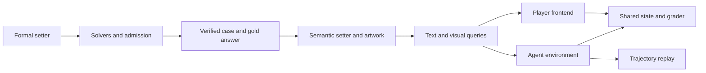

# Architecture

Murdoku Lab generates verified puzzles, adds semantic presentation, exports text
and visual queries, and runs interactions against the same task state and grader.



## Code map

Python code lives in the installable `murdoku_lab` package.

| Directory | Owns | Main entry points |
| --- | --- | --- |
| `core/` | Board, predicates, case/theme schemas and public text rendering | `instance.py`, `atoms.py`, `render.py` |
| `solver/` | Exact solutions, deductions, difficulty and reasoning profiles | `exact.py`, `logic.py`, `oracle.py` |
| `setter/` | Formal generation, admission, semantic presentation and query export | `generate.py`, `pipeline.py`, `llm_setter.py`, `export_queries.py` |
| `environment/` | Task state, grading, actions, canonical prompt, tools and replay | `state.py`, `scoring.py`, `answer_text.py`, `validation.py`, `protocol.py`, `queries.py`, `tools.py`, `vision.py`, `replay.py` |
| `evaluation/` | Native-tool benchmark, text-ACTION baseline, analysis and calibration | `tools.py`, `text_actions.py`, `run.py`, `analyse.py`, `calibrate.py`, `roundtrip.py` |
| `visual/` | Public projection, artwork, rasterization, player sessions and HTTP API | `projection.py`, `art.py`, `raster.py`, `session.py`, `server.py` |
| `resources/` | Bundled difficulty, artwork-selection, theme and tool defaults | JSON and text resources |

Paths above are relative to `murdoku_lab/`. Repository-level directories contain:

- `config/`: user-facing endpoint examples and scene specifications.
- `scripts/`: data download, query preparation and rendering commands.
- `web/src/`: React application, reusable components and API/export helpers.
- `requirements/`: installation shortcuts and optional dependency groups.
- `tests/`: solver agreement, theme invariance, environment, replay and frontend contracts.
- `docs/`: usage guides and interface reference.

### Player frontend

`web/src/App.jsx` owns the active session, history, selections and API actions.
The components receive that state and callbacks; each interaction updates the
same session through the server.

| Module under `web/src/` | Owns |
| --- | --- |
| `components/ScenePanel.jsx` | Board, placement controls, zoom and image export |
| `components/CastPanel.jsx` | Person selection and placement status |
| `components/EvidencePanel.jsx` | Clue checklist and verdict controls |
| `components/SessionDialogs.jsx` | Case selection, notes, history, submission and results |
| `components/ReferenceDialogs.jsx` | Help, object key and credits |
| `components/Controls.jsx`, `components/EmphasizedClue.jsx` | Shared UI controls and clue text |
| `lib/api.js`, `lib/export.js`, `urls.js` | HTTP requests, downloads and mount-aware URLs |

## Task interface

`murdoku_lab.environment.environment_for(record)` selects the text or visual
interface. Both share state, grading and coordinate-based actions. The canonical
prompt lives in `environment/protocol.py`; replay lives in `environment/replay.py`.
The native benchmark in `evaluation/tools.py` uses these same implementations.

Python execution subclasses Agent Horizon's `PythonTool` to select the task
runtime. Workspace, notes and context feedback import Agent Horizon directly.
The grader can be imported independently of these execution tools.

Visual inputs carry the board image plus public clues and rules. Public rendering
lives in `core/render.py` and `visual/`; it does not depend on benchmark runners.
The text-ACTION baseline remains in `evaluation/` for comparison.

## Artifacts and splits

| Artifact | Contents |
| --- | --- |
| Verified case | Formal puzzle, solution and certificate |
| Theme | Names, rooms, object labels and artwork IDs |
| Query | Public messages/tools and trusted environment fields |
| Raw attempt | Responses, tool observations and termination |
| Accepted rollout | Verified messages/tools and replay result |
| Unified JSONL | Query, split and optional accepted rollout |

The solution is established before the semantic setter adds presentation.
Model requests use public messages and tool schemas; trusted grader fields stay
in the environment. Images, generated queries and trajectories are data artifacts.
Licensed source artwork belongs in the package.

Training uses generated cases; validation uses disjoint generated cases; official
puzzles form the transfer test. Freeze identities and splits before training export.

[Agent Horizon](https://github.com/EverywhereSafety/agent-horizon) owns episode
context and distributed training. Its Murdoku demo imports this package and
translates the task into the framework's environment contract.

## Development

```bash
pip install -e ".[dev]"
python -m black --check .
python -m pytest -m "not slow"
```

Bundled defaults, themes, case fixtures and artwork are included in Python builds.
Frontend serving and PNG rendering additionally use the project built with `npm ci`
and `npm run build`. Set `MURDOKU_PROJECT_ROOT` to that checkout when using an
installed wheel outside the checkout.
